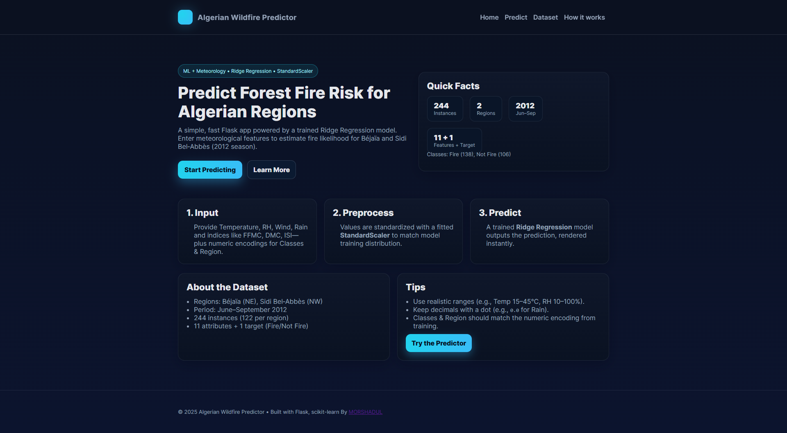
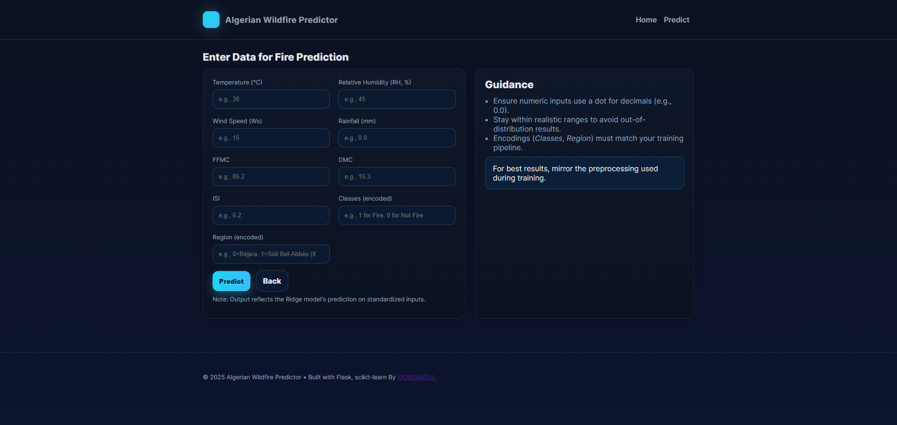

# 🔥 Algerian Wildfire Prediction – End-to-End Flask App

This repository contains an **end-to-end Machine Learning project** that predicts wildfire risk in Algeria using the **Algerian Forest Fires dataset** (June–Sept 2012).  
The project covers everything from **data preprocessing, model training, and evaluation**, to deploying a **Flask web application** for user interaction.

---

## ✨ Features
- **End-to-end ML pipeline**: Preprocessing → Training → Deployment
- **Flask Web App** with user-friendly form
- **Prediction Output**: Fire / Not Fire
- **Clean UI** with modern design, header/footer, and info sections
- **REST-style API endpoint** for JSON predictions
- Fully documented **dataset attributes** for clarity

---

## 🖼️ Application Screenshots
### Landing Page


### Prediction Page



## 📂 Project Structure

├─ application.py # Flask application entry point
├─ requirements.txt # Project dependencies
├─ models/
│ ├─ ridge.pkl # Trained Ridge Regression model
│ └─ scaler.pkl # StandardScaler
├─ templates/
│ ├─ index.html # Landing page
│ ├─ home.html # Prediction page
├─ static/
│ └─ style.css # Custom styles
├─ data/
│ └─ algerian_fires.csv # Dataset (optional if not included)
└─ README.md

### 1️⃣ Clone the Repository
```bash
git clone https://github.com/Hiremorshadul/wildfire-predictor-flask.git
